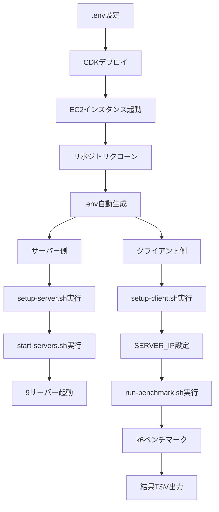

# .env 統合設計 - 各コンポーネントでの利用方法

## 1. サーバー実装での.env 利用

### 1.1 TypeScript サーバー共通設定

```javascript
// servers/common/config-loader.js
import { config } from "dotenv";
import { resolve } from "path";

// プロジェクトルートの.envを読み込み
config({ path: resolve(__dirname, "../../.env") });

export const serverConfig = {
  originUrlBase: process.env.ORIGIN_URL_BASE || "http://localhost:8080/",
  serverStartPort: parseInt(process.env.SERVER_START_PORT || "3001"),
  workerThreads: parseInt(process.env.SERVER_WORKER_THREADS || "0"),
};
```

### 1.2 各フレームワークでのポート計算

```javascript
// TypeScript: fastify (ポート3001)
const port = serverConfig.serverStartPort + 0;

// TypeScript: hono (ポート3002)
const port = serverConfig.serverStartPort + 1;

// TypeScript: elysia (ポート3003)
const port = serverConfig.serverStartPort + 2;

// Go: fiber (ポート3004)
// Go: gin (ポート3005)
// Go: echo (ポート3006)

// Rust: actix (ポート3007)
// Rust: axum (ポート3008)
// Rust: rocket (ポート3009)
```

### 1.3 プロキシエンドポイントの実装例

```javascript
// プロキシURLの構築
app.get("/proxy/20k", async (req, res) => {
  const imageUrl = `${serverConfig.originUrlBase}20k.jpg`;
  // プロキシ処理
});
```

## 2. k6 ベンチマークスクリプトでの.env 利用

### 2.1 設定読み込み (k6/config.js)

```javascript
// Node.jsで.envを読み込んでk6に渡す
import { config } from "dotenv";
import { resolve } from "path";

config({ path: resolve(__dirname, "../.env") });

export const benchmarkConfig = {
  serverIp: process.env.SERVER_IP || "localhost",
  serverStartPort: parseInt(process.env.SERVER_START_PORT || "3001"),
  duration: process.env.BENCHMARK_DURATION || "60s",
  warmupDuration: process.env.BENCHMARK_WARMUP_DURATION || "10s",
  cooldownDuration: process.env.BENCHMARK_COOLDOWN_DURATION || "10s",
  maxVUs: parseInt(process.env.MAX_VUS || "200"),
  errorThreshold: parseFloat(process.env.ERROR_THRESHOLD || "0.01"),
  responseTimeThreshold: parseInt(
    process.env.RESPONSE_TIME_THRESHOLD || "1000"
  ),
};
```

### 2.2 k6 テストシナリオ (k6/benchmark.js)

```javascript
import http from "k6/http";
import { check, sleep } from "k6";

// 環境変数から設定を取得
const SERVER_IP = __ENV.SERVER_IP;
const SERVER_START_PORT = __ENV.SERVER_START_PORT;
const MAX_VUS = __ENV.MAX_VUS;

// テスト対象のエンドポイント生成
const servers = [
  { name: "fastify", port: parseInt(SERVER_START_PORT) + 0 },
  { name: "hono", port: parseInt(SERVER_START_PORT) + 1 },
  // ... 他のサーバー
];

const endpoints = [
  "/local/20k",
  "/local/50k",
  "/local/100k",
  "/proxy/20k",
  "/proxy/50k",
  "/proxy/100k",
];

export const options = {
  scenarios: {
    benchmark: {
      executor: "ramping-vus",
      startVUs: 10,
      stages: [
        { duration: __ENV.BENCHMARK_WARMUP_DURATION, target: 10 },
        { duration: __ENV.BENCHMARK_DURATION, target: parseInt(MAX_VUS) },
        { duration: __ENV.BENCHMARK_COOLDOWN_DURATION, target: 0 },
      ],
    },
  },
  thresholds: {
    http_req_failed: [`rate<${__ENV.ERROR_THRESHOLD}`],
    http_req_duration: [`p(95)<${__ENV.RESPONSE_TIME_THRESHOLD}`],
  },
};
```

## 3. シェルスクリプトでの.env 利用

### 3.1 共通読み込みユーティリティ (scripts/utils/load-env.sh)

```bash
#!/bin/bash

# .envファイルの読み込み
PROJECT_ROOT="$(cd "$(dirname "${BASH_SOURCE[0]}")/../.." && pwd)"
ENV_FILE="$PROJECT_ROOT/.env"

if [ -f "$ENV_FILE" ]; then
  export $(cat "$ENV_FILE" | grep -v '^#' | xargs)
fi

# デフォルト値の設定
: ${ORIGIN_URL_BASE:="http://localhost:8080/"}
: ${SERVER_START_PORT:=3001}
: ${SERVER_IP:=""}
: ${BENCHMARK_DURATION:="60s"}
```

### 3.2 start-servers.sh での利用

```bash
#!/bin/bash
source "$(dirname "$0")/utils/load-env.sh"

echo "Starting servers with base port: $SERVER_START_PORT"

# TypeScript servers
cd servers/typescript/fastify && npm start -- --port $((SERVER_START_PORT + 0)) &
cd servers/typescript/hono && npm start -- --port $((SERVER_START_PORT + 1)) &
# ... 他のサーバー
```

### 3.3 run-benchmark.sh での利用

```bash
#!/bin/bash
source "$(dirname "$0")/utils/load-env.sh"

# SERVER_IPが未設定の場合は入力を求める
if [ -z "$SERVER_IP" ]; then
  read -p "Enter server IP address: " SERVER_IP
  echo "SERVER_IP=$SERVER_IP" >> "$ENV_FILE"
fi

# k6実行時に環境変数を渡す
k6 run \
  -e SERVER_IP="$SERVER_IP" \
  -e SERVER_START_PORT="$SERVER_START_PORT" \
  -e MAX_VUS="$MAX_VUS" \
  -e BENCHMARK_DURATION="$BENCHMARK_DURATION" \
  -e BENCHMARK_WARMUP_DURATION="$BENCHMARK_WARMUP_DURATION" \
  -e BENCHMARK_COOLDOWN_DURATION="$BENCHMARK_COOLDOWN_DURATION" \
  -e ERROR_THRESHOLD="$ERROR_THRESHOLD" \
  -e RESPONSE_TIME_THRESHOLD="$RESPONSE_TIME_THRESHOLD" \
  k6/benchmark.js
```

## 4. プロキシ用画像の準備

### 4.1 S3 バケットへの画像アップロード

```bash
# images/upload-to-s3.sh
#!/bin/bash
source "$(dirname "$0")/../scripts/utils/load-env.sh"

# ORIGIN_URL_BASEからバケット名を抽出
BUCKET_NAME=$(echo $ORIGIN_URL_BASE | sed -E 's|https?://([^/]+)\.s3\..*\.amazonaws\.com/.*|\1|')
PREFIX=$(echo $ORIGIN_URL_BASE | sed -E 's|https?://[^/]+/(.*)/|\1|')

# 画像をアップロード
aws s3 cp 20k.jpg "s3://$BUCKET_NAME/$PREFIX/20k.jpg"
aws s3 cp 50k.jpg "s3://$BUCKET_NAME/$PREFIX/50k.jpg"
aws s3 cp 100k.jpg "s3://$BUCKET_NAME/$PREFIX/100k.jpg"

# パブリックアクセスを許可（必要に応じて）
aws s3api put-object-acl --bucket "$BUCKET_NAME" --key "$PREFIX/20k.jpg" --acl public-read
aws s3api put-object-acl --bucket "$BUCKET_NAME" --key "$PREFIX/50k.jpg" --acl public-read
aws s3api put-object-acl --bucket "$BUCKET_NAME" --key "$PREFIX/100k.jpg" --acl public-read
```

## 5. 実行フロー全体像



## 6. トラブルシューティング用環境変数

```bash
# デバッグモード
DEBUG=true

# ログレベル
LOG_LEVEL=info

# タイムアウト設定
HTTP_TIMEOUT=30000

# リトライ設定
MAX_RETRIES=3
```
